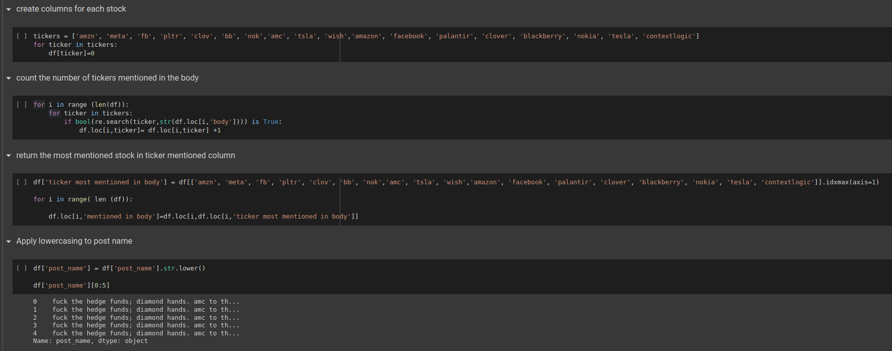
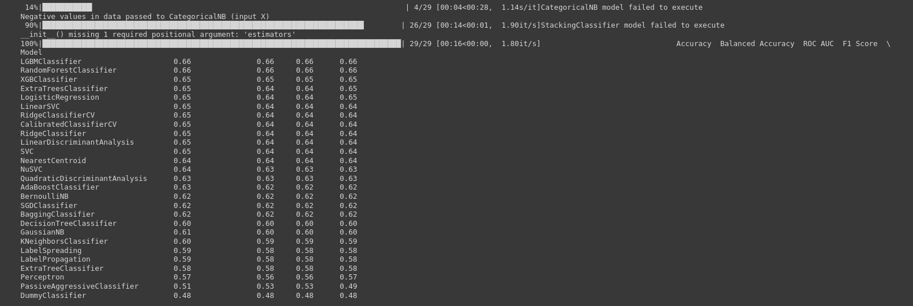

* All file [Datasets](https://drive.google.com/drive/folders/1Q4dtJzIFRQfACgEOSoswOCzkLDYHmMe7?usp=share_link) in Google drive

* All the [model](https://drive.google.com/drive/folders/1slfMN9-07mjeTqE18cyF7iDmmXKYKq23?usp=share_link) in Google drive for different ticket

* Scrapping Reddit Posts

* Scrapping and Combine Reddit POSTS

    + Link of the [Code](https://colab.research.google.com/drive/13qBX4D7bKcqB1e4F4fdZ9Jjgr9aeuvbp?usp=sharing) Scrapping Reddit Posts
    
    + Link of the [Code](https://colab.research.google.com/drive/1x1U7UI18M6PWoGCQfprdt07GC1qbt5Bv?usp=sharing) Scrapping and Combine Reddit POSTS

    + Link of the [Data](https://drive.google.com/file/d/1c-IX1vDVhKIu8BN6xo4rIK3w5aDuO7D3/view?usp=share_link)
      + Data is from 
        + Wednesday, February 3, 2021 1:47:49 AM ---- Friday, December 10, 2021 1:58:56 AM
      + Number of raw ( 1092980 raw and 11 columns )
      + Columns name: `filename`,	`author`,	`body`,	`created_utc`,	`id`,	`link_id`,	`permalink`,	`score`,	`subreddit`,	`search_term`,	`post_name`.

* Assign POSTS
  
    + Link of the [Code](https://colab.research.google.com/drive/1m-TyVwLrp95uU6h2OED49NcDMT5NyVzv?usp=sharing)
    + Link of the [Data](https://drive.google.com/drive/folders/1XwL3TW2te1u7tJtN98b-UxoK5IUhakx1?usp=share_link)

    
    
    

    

* Text Preprocessing
    
    + Link of the [Code](https://colab.research.google.com/drive/13ctiUHwwLMA8_gvkqG67W-TiL8e7aATV?usp=sharing)
    + Link of the [Data](https://drive.google.com/drive/folders/1iK4FOSeuvG-GIHrqxzxofcOjZu71O8Jh?usp=share_link)

    

    + Link of the [Dictionary](https://drive.google.com/file/d/1Lj0WcmBsIGIY4tFeSK6jb_etTjEb5S2b/view?usp=share_link)

    
    

* Classical models for sentiment analysis
  
    + Link of the [Code](https://colab.research.google.com/drive/1D80zNap5sX0KMmO_8ZsdHZG_LggjvT43?usp=sharing)

    Model 1
    
    

    Model 2 ( Adding bert and vader to the data )
    
    

  * Using BERT

      + Link of the [Code](https://colab.research.google.com/drive/1psGaA__qZsOIi3jmh_XzRY4Yd1YCSb2u?usp=sharing)

      + Model 1
      
      

      + Model 2
      
      

* Classical models for sentiment analysis with PCA & UMAP.ipynb
  
    + Link of the [Code](https://colab.research.google.com/drive/11OMYbVgg_h2Mz7srUgA11ieA4sbYE_JA?usp=sharing)
    
    + PCA
    
    

    + UMAP
    
    

* VADER
  
    + Link of the [Code](https://colab.research.google.com/drive/1Y5oka9gcRIqF7qU4K9_wVmNCbpAI7q_4?usp=sharing)

    
    
